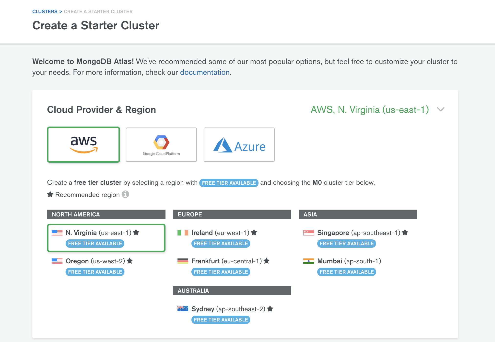
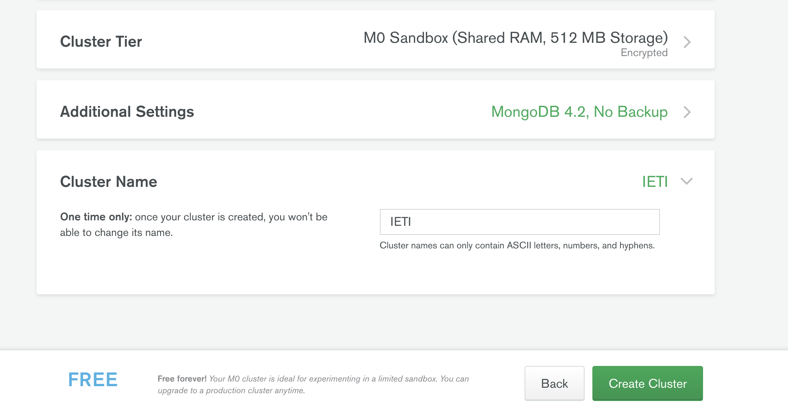
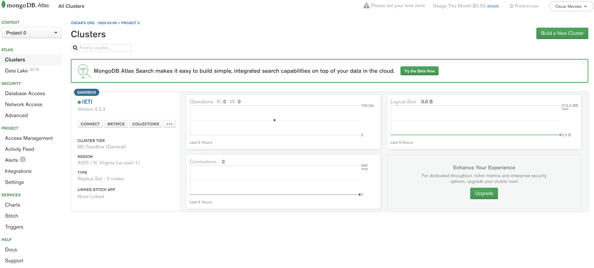
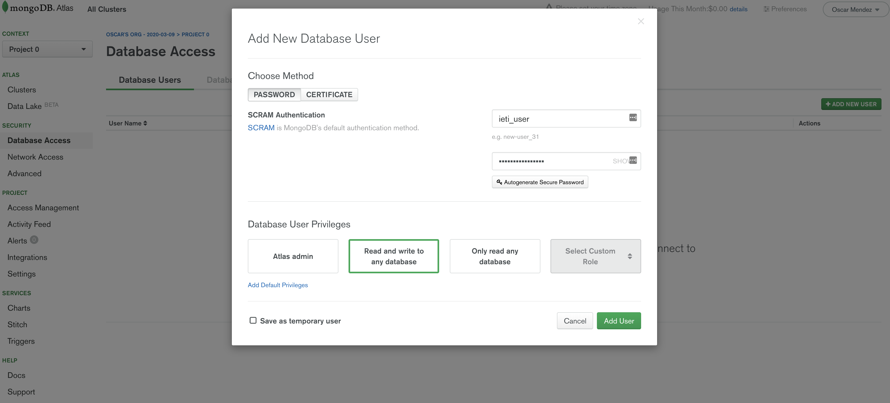
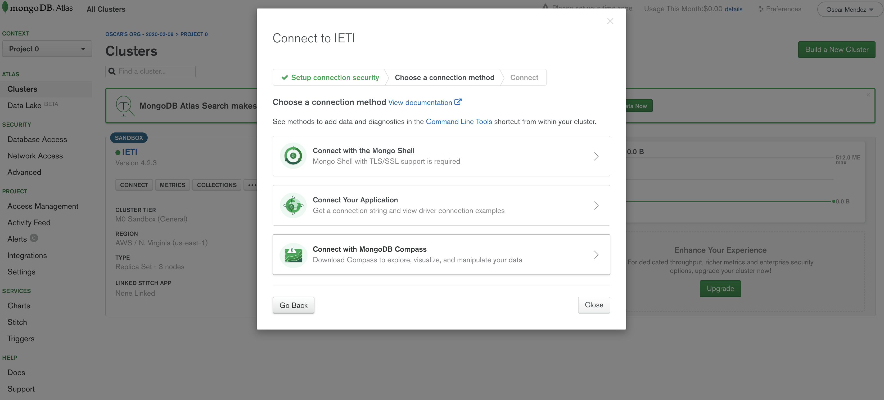

# LAB9-IETI
# Autor
   * [Fernando Barrera Barrera](https://github.com/fernando-b15) :guitar:   
# Preguntas   
   * ¿Cuántos clientes se crearon en la base de datos?\
     Se crearon 5 customers en la base de datos
   * ¿Dónde se implementa el método findAll?\
     Este metodo esta implmenetado en el MongoRepository 
   * Suponga que tiene más de 1000 productos en su base de datos. ¿Cómo implementaría un método para respaldar la paginación y devolver páginas de 50 productos a su interfaz?\
      Usaria el metodo PageRequest.of y dado que necesitariamos los primeros 50 productos seria productRepository.findBy(PageRequest.of(0,50))
   * ¿Cuántos productos contienen la palabra "plus" en su descripción?\
      Hay 4 productos en la base de datos que en su descripcion contiene la palablar plus
   * ¿Cuántos productos devuelve la consulta findByDescriptionContaining? ¿Por qué?\
      Devuelve solo 2 productos pero en realidad el total de productos en la base de datos que tiene la palabra plus son 4 pero el metodo tambien recibe un parametro de pegeable en el que se  especifica que solo devuelva los dos primeros productos con la palabra plus
   * ¿Cuáles son los nombres de las colecciones donde se almacenan los objetos? ¿Dónde se asignan esos nombres?\
    Inicialmente si no se  especifican los nombres de los documentos estos toman el mismo nombre de la clase entidad que los referencia pero si quisieramos asignarle un nombre distinto al documento se hace mediante la siguiente instruccion @Document(collection = "nombre diferente al de la clase")
# Queries   

## Queries con Criteria
   * Query 1\
   
   * Query 2\
   
   * Query 3\
    
   * Query 4\
   

## Queries con Metodos MongoRepository 
   * Query 1\
    
   * Query 2\
    
   * Query 3\
    
   * Query 4\
    

## Part 1: Basic Mongo DB configuration and Spring Boot Integration
1. Create a MongoDB Atlas account on [https://www.mongodb.com/atlas-signup-from-mlab](https://www.mongodb.com/atlas-signup-from-mlab):

    * Select the free tier:
        

2. Configure the MongoDB Cluster:
 
    * Create a new Starter Cluster (free) using any Cloud Provider and Region
   
        

     * Scroll down to _Cluster Name_ and give the cluster a name. Click on *Create Cluster*

        

    * Wait until the cluster is provisioned and gets ready

           

    * Go to Database Access menu on the left panel and create a user and a password for connecting to the DB
    
        
        
    * Go to Network Access on the left panel and add your IP so that it lets the application connect from your current IP address
    
        

        
        
    * Go to the cluster menu on the left panel and click on the _Connect_ button
    
        
        
    * Select the option *Connect Your Application* and then copy the connection string. Before using it, replace the \<password\> placeholder with the password of the user you created previously.
        
        
        
        
         
        
        
3. Clone this repo.

4. Create a new file in the root folder named *application.yml*.

5. Copy the following contents and replace the connection string placeholder with the value you got in the previous step. 

    ``` yaml
    spring:
      data:
        mongodb:
          uri: <CONNECTION_STRING> 
    ```

6. Run the project and verify that the connection to the database works properly. Answer the following questions:

- How many customers were created in the database?
- Where is the *findAll* method implemented?
- Suppose you have more than 1000 products in your database. How would you implement a method for supporting pagination and return pages of 50 products to your frontend?
- How many products contain the "plus" word in their description?
- How many products are returned by the *findByDescriptionContaining* query? Why?
- Which are the collection names where the objects are stored? Where are those names assigned?

5. Create two more models (User and Todo) with the following structure:

    User
    ````Javascript
        
        {
            "id": "12354",
            "name": "Charles Darwin",
            "email": "charles@natural.com"
        }
        
     
    ````     
    
    Todo
    ````Javascript
        
        {
            "description": "travel to Galapagos",
            "priority": 10,
            "dueDate": "Jan 10 - 1860"
            "responsible": "charles@natural.com"
            "status": "pending"
        }
    ````                  
    
    
6. Create a repository for the _Users_ using the *CustomerRepository* as reference.

7. Create a repository for the _Todos_ using the *ProductRepository* as reference.

8. Add a *findByResponsible* method to the TodoRepository and verify it works. The method must support pagination

*Note:* You can find more information about Spring Data for Mongo DB [here](https://spring.io/projects/spring-data-mongodb) and some code samples [here](https://github.com/spring-projects/spring-data-book/tree/master/mongodb). 


## Part 2: Custom configuration and Queries

1. Create a configuration class with the following code:

    ````java

    @Configuration
    public class AppConfiguration {
    
        @Bean
        public MongoDbFactory mongoDbFactory() throws Exception {
    
             MongoClientURI uri = new MongoClientURI(
            "mongodb+srv://sancarbar:<password>@cluster0-dzkk5.mongodb.net/test?retryWrites=true&w=majority");

            MongoClient mongoClient = new MongoClient(uri);

            return new SimpleMongoDbFactory( mongoClient, "test");
    
        }
    
        @Bean
        public MongoTemplate mongoTemplate() throws Exception {
    
            MongoTemplate mongoTemplate = new MongoTemplate(mongoDbFactory());
    
            return mongoTemplate;
    
        }
    
    }
    
    ````

2. Replace the credential values and the server address.

3. Add the following code to your Application run method to access the *MongoTemplate* object:

    ````java
    
        ApplicationContext applicationContext = new AnnotationConfigApplicationContext(AppConfiguration.class);
        MongoOperations mongoOperation = (MongoOperations) applicationContext.getBean("mongoTemplate");
     
    ````     
    
4. The *MongoOperations* instance allows you to create custom queries to access the data by using the *Query* object:
 
    ````java
    
       Query query = new Query();
       query.addCriteria(Criteria.where("firstName").is("Alice"));
    
       Customer customer = mongoOperation.findOne(query, Customer.class);
     
    ````  

5. Read some of the documentation about queries in Spring Data MongoDB:
 
    * https://www.baeldung.com/queries-in-spring-data-mongodb
    * https://www.mkyong.com/mongodb/spring-data-mongodb-query-document/

6. In the *Application* class create mocked data for 25 Todos and 10 different users (make sure the Todos have different dueDates and responsible)

7. Create the following queries using the Query class:

    * Todos where the dueDate has expired
    * Todos that are assigned to given user and have priority greater equal to 5
    * Users that have assigned more than 2 Todos.
    * Todos that contains a description with a length greater than 30 characters        

8. Implement the queries of the previous step using *derived query methods* in your repository interface. Is it possible to implement all of them?
